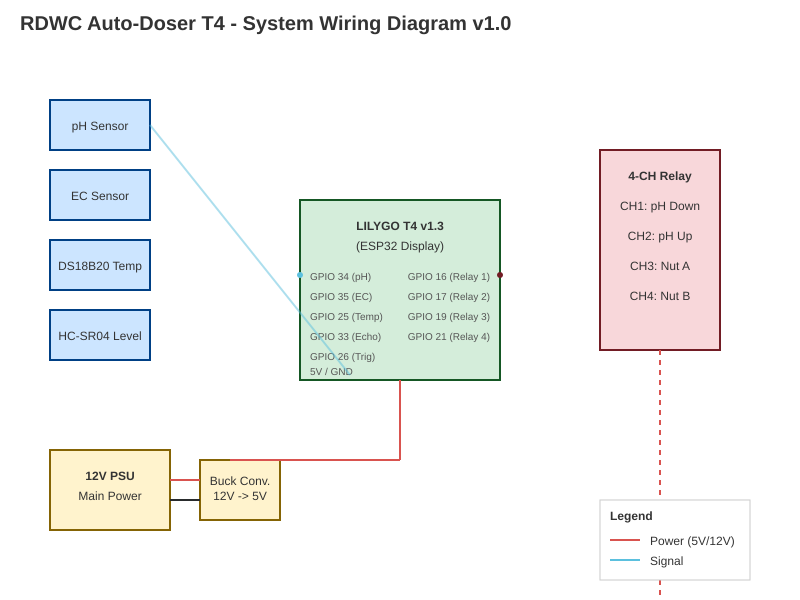
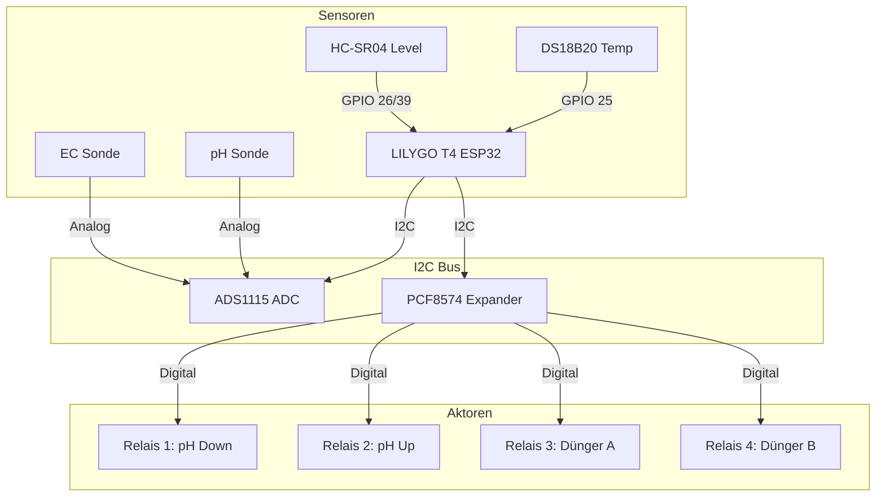

# Verkabelungsanleitung (Hardware Setup)

Diese Anleitung erklärt den Anschluss des LILYGO T4 an die externen I2C-Module.

## System-Übersicht

## Architektur (Mermaid)

## I2C-Bus Verbindung
Das LILYGO T4 nutzt **SDA: GPIO 21** und **SCL: GPIO 22**. Diese müssen mit Sensoren und Relais verbunden werden.

| LILYGO T4 | Komponente |
| :--- | :--- |
| 3.3V | VCC (Spannung prüfen!) |
| GND | GND |
| GPIO 21 (SDA) | SDA |
| GPIO 22 (SCL) | SCL |

## ADS1115 (Sensoren)
*   **Adresse:** 0x48 (Addr Pin auf GND)
*   **A0:** pH-Sensor Signal
*   **A1:** EC-Sensor Signal

## PCF8574 (Relays)
*   **Adresse:** 0x20 (Alle Schalter AUS/GND)
*   **P0:** Pumpe 1 (pH Down)
*   **P1:** Pumpe 2 (pH Up)
*   **P2:** Pumpe 3 (Dünger A)
*   **P3:** Pumpe 4 (Dünger B)